# QUADRUPED ROBOT     

โปรเจคนี้ทำเพื่อใช้ในการศึกษารูปแบบการขยับขาของหุ่นยนต์ Quadruped Robot และคำนวณหา Forward Kinematics และ Inverse Kinematics ของหุ่นยนต์ Quadruped Robot โดยเมื่อทราบความยาวของแต่ละข้อต่อของแขนหุ่นยนต์แล้ว จากนั้นจะเลือกใช้วิธีการหา DH parameter เพื่อหาตำแหน่งสุดท้ายของขาหุ่นยนต์ Quadruped Robot แล้วจากนั้นจึงคำนวณ Trajectory Planning เพื่อให้สามารถควบคุมลักษณะการเคลื่อนที่ของหุ่นพร้อมทั้งสังเกตและเข้าใจการเคลื่อนไหวของหุ่นยนต์ได้ง่ายขึ้น

**Keyword: Quadruped Robot, Forward Kinematic, Inverse Kinematic, DH Parameter, Trajectory Planning**


## ผู้จัดทำ

- นางสาว ฐิติรัตน์ สันติไชยกุล	65340500018
- นาย ภวดล กิรติพงษ์วุฒิ	65340500047
- นาย กษิดิษฐ์ รังสีวิจิตรประภา	65340500064
- นางสาว ชนันชิดา โปร่งจิต	65340500066

## บทที่ 1 บทนำ (Introduction)

### 1.1 จุดประสงค์ของโครงการ
1. เพื่อศึกษาการเคลื่อนที่ของ Quadruped Robot ในปริภูมิ 3 มิติ  
2. เพื่อศึกษาการทำ Simulation ของ Quadruped Robot ในปริภูมิ 3 มิติ  
3. เพื่อประยุกต์ใช้ความรู้ Kinematic เพื่อหา Task Space ของ Quadruped Robot  

### 1.2 ขอบเขตของโครงการ
โปรเจคนี้จะทำการ Simulation เพื่อคำนวณ Task Space และการเคลื่อนที่ของ Quadruped Robot  

#### A. ขอบเขตในส่วนของ Pose Kinematic
1. คำนวณเฉพาะ Forward Kinematic ของขาหุ่นแต่ละข้าง  
2. คำนวณเฉพาะ Inverse Kinematic ของขาหุ่นแต่ละข้าง  
3. คำนวณ Trajectory Planning ของขาหุ่น  

#### B. ขอบเขตในส่วนของ Quadruped Robot
1. คำนวณเพื่อหา Velocity และตำแหน่ง Task Space ของหุ่นยนต์ขณะเคลื่อนที่  
2. ลักษณะการเคลื่อนที่ของหุ่นต้องเคลื่อนที่ในสภาพแวดล้อมแบบอุดมคติเท่านั้น
3. หุ่นยนต์จะเคลื่อนที่ในลักษณะ "การเดินขาคู่ (Troting)" เท่านั้น  

#### C. จำนวน Joint ในแต่ละขา
1. ขาหุ่นยนต์แต่ละข้างจะมีได้สูงสุด 3 Joint เท่านั้น  

#### D. ข้อมูล Input ที่ต้องใช้ในการคำนวณ
1. ความยาวของแต่ละส่วนในขาหุ่น  
2. ตำแหน่งปลายทางที่ต้องการให้หุ่นเคลื่อนที่ไป  
3. ความเร็วเชิงเส้นสูงสุดของหุ่นยนต์  
4. ระยะเวลาที่หุ่นยนต์ใช้ในการเคลื่อนที่  

## บทที่ 2 ทบทวนวรรณกรรมและทฤษฎีที่เกี่ยวข้อง

### 2.1 การพัฒนาหุ่นยนต์ที่ลอกเลียนแบบการเคลื่อนที่ของสัตว์

หุ่นยนต์ที่มีการเคลื่อนที่คล้ายสุนัข โดยมีตัวอย่างมาจากหุ่น Spot-Mini ของ Boston Dynamics ที่มี  4 ขา พร้อมกับการควบคุมการเคลื่อนที่แบบอัตโนมัติ สามารถมีปฏิสัมพันธ์กับสิ่งต่างๆได้ และสามารถเคลื่อนที่ได้เหมือนสัตว์

ตัวอย่างของหุ่นยนต์ที่ได้รับแรงบันดาลใจจากการเคลื่อนที่ของสัตว์ ได้แก่

- **Spot-Mini จาก Boston Dynamics**  
   หุ่นยนต์ 4 ขาที่ออกแบบให้มีการเคลื่อนที่แบบอัตโนมัติและสามารถปฏิสัมพันธ์กับสิ่งแวดล้อมได้  
   หุ่นยนต์ตัวนี้สามารถเคลื่อนที่ได้เหมือนสุนัข และมีฟังก์ชันการทำงานที่หลากหลาย เช่น การเดินและการหลีกเลี่ยงสิ่งกีดขวาง  

   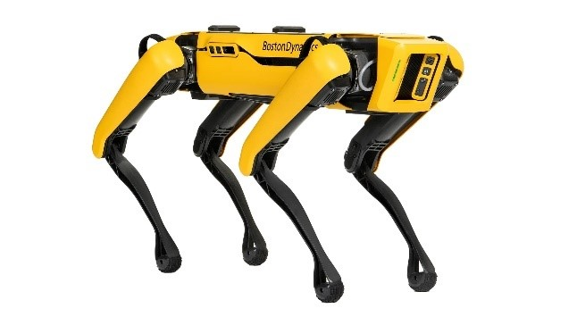  
*รูปที่ 1 Spot-Mini By Boston Dynamics*


- **AIBO จาก Sony**  
   หุ่นยนต์สุนัขที่ถูกออกแบบให้เคลื่อนไหวคล้ายสุนัขจริง โดยมีการเคลื่อนไหวที่เป็นธรรมชาติและสามารถโต้ตอบกับผู้ใช้งานได้  

   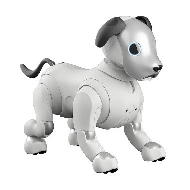  
*รูปที่ 2 AIBO Robot By Sony*

ตัวอย่างเหล่านี้เป็นแรงบันดาลใจสำคัญในการพัฒนา Quadruped Robot ที่มีลักษณะการเคลื่อนที่คล้ายสัตว์ และช่วยให้การศึกษาการเคลื่อนไหวในปริภูมิ 3 มิติของหุ่นยนต์ประเภทนี้มีความน่าสนใจมากยิ่งขึ้น

### 2.2 จลน์ศาสตร์ไปข้างหน้าของหุ่นยนต์ 4 ขา (Forward Kinematics of Quadruped Robot)

การคำนวณตำแหน่งของส่วนปลายของขาหุ่นยนต์ (end-effector) จากมุมของข้อต่อแต่ละข้างมีความสำคัญอย่างยิ่งในการเคลื่อนที่ของหุ่นยนต์ โดยเมื่อทราบมุมการหมุนของข้อต่อแต่ละข้างและความยาวของแต่ละส่วนของขา หุ่นยนต์จะสามารถคำนวณตำแหน่งของปลายขาได้ในพิกัด X, Y และ Z  

ในกรณีของหุ่นยนต์คล้ายสุนัข ขาแต่ละข้างประกอบด้วย 3 ข้อต่อที่สามารถหมุนได้ ซึ่งจะควบคุมมุมของข้อต่อโดยใช้เซอร์โวมอเตอร์  โดยเมื่อกำหนดมุมการหมุนของข้อต่อแล้ว จะใช้ **Forward Kinematics** ในการคำนวณตำแหน่งของปลายขาในแต่ละจังหวะการเคลื่อนที่ เพื่อให้แน่ใจว่าการเคลื่อนไหวเป็นไปอย่างราบรื่นและแม่นยำ  

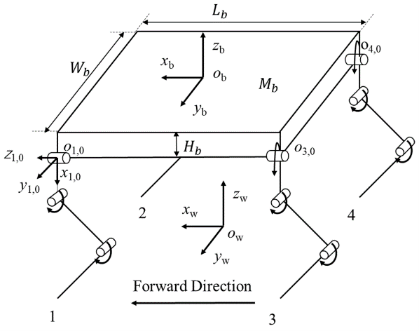  
*รูปที่ 3 แบบจำลองโครงสร้างของ Dog – like Robot*

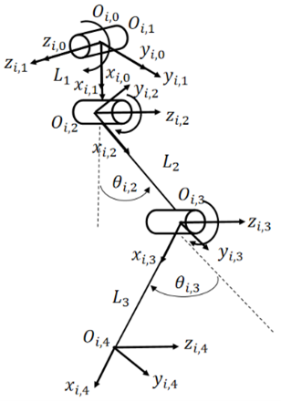  
*รูปที่ 4 แบบจำลองโครงสร้างของขา 1 ขาของ Dog - like Robot*

จากรูปที่ 4 สามารถหา Transformation Matrix และตำแหน่งปลายเท้าของหุ่นยนต์ได้ดังนี้

## ขั้นตอนการคำนวณ

### 1. การคำนวณ Transformation Matrix


การคำนวณ Transformation Matrix ของแต่ละ joint สามารถทำได้โดยการใช้ **Denavit-Hartenberg Parameters** ซึ่งประกอบด้วย 4 ค่าหลัก ดังนี้:
- **$( a_i )$**: ความยาวของลิงค์ (Link length)
- **$( alpha_i )$**: มุมระหว่างแกน $( z_i )$ และ $( z_{i-1} )$ (Twist angle)
- **$( theta_i )$**: มุมการหมุนในระนาบ ( xy ) (Joint angle)
- **$( d_i )$**: ความยาวการแปลงในแกน $( z )$ (Link offset)

โดย **Transformation Matrix** จากแต่ละข้อ $( i )$ ไปยัง $( i-1 $) จะมีรูปแบบดังนี้

$$
T_i^{i-1} = 
\begin{bmatrix}
\cos\theta_i & -\sin\theta_i \cos\alpha_i & \sin\theta_i \sin\alpha_i & a_i \cos\theta_i \\
\sin\theta_i & \cos\theta_i \cos\alpha_i & -\cos\theta_i \sin\alpha_i & a_i \sin\theta_i \\
0 & \sin\alpha_i & \cos\alpha_i & d_i \\
0 & 0 & 0 & 1
\end{bmatrix}
$$

### 2. การคำนวณ Transformation Matrix สำหรับแต่ละข้อ

สมมุติว่าเรามีการคำนวณ **Transformation Matrix** สำหรับแต่ละข้อ (จากข้อแรกไปจนถึงข้อสุดท้ายของหุ่นยนต์) โดยการคูณ Transformation Matrix ของแต่ละข้อเข้าด้วยกัน

$$
T_0^n = T_0^1 \cdot T_1^2 \cdot \ldots \cdot T_{n-1}^n
$$

ที่นี่ $T_0^n$ คือ Transformation Matrix จากฐาน (frame 0) ไปยังตำแหน่ง $( n )$-th joint หรือ frame ที่เราต้องการ

### 3. การคำนวณตำแหน่งปลายเท้า (End-Effector Position)

ตำแหน่งปลายเท้าของหุ่นยนต์ (End-Effector) สามารถหาได้จากค่านี้

$$
P_n = T_0^n \cdot P_0
$$

โดยที่ $( P_0 )$ คือจุดเริ่มต้นของหุ่นยนต์ (มักเป็นจุดศูนย์กลาง) และ $( T_0^n )$ คือ Transformation Matrix ที่คำนวณจากขั้นตอนก่อนหน้า

**สามารถหา Transformation Matrix และตำแหน่งปลายเท้าของหุ่นยนต์ได้เท่ากับ**

### สมการ (1): แสดง Transformation matrix ตั้งแต่ Frame 0 ถึง Frame End-effector

$$
T_e^0{}_i =
\begin{bmatrix}
c_{i,1} c_{i,23} & -c_{i,1} s_{i,23} & -s_{i,1} & c_{i,1} L_1 + c_{i,1} c_{i,2} L_2 + c_{i,1} c_{i,23} L_3 \\
s_{i,1} c_{i,23} & -s_{i,1} s_{i,23} & c_{i,1} & s_{i,1} L_1 + s_{i,1} c_{i,2} L_2 + s_{i,1} c_{i,23} L_3 \\
-s_{i,23} & -c_{i,23} & 0 & -s_{i,2} L_2 - s_{i,23} L_3 \\
0 & 0 & 0 & 1
\end{bmatrix}
$$

### สมการ (2): แสดง Position ที่ปลายหุ่นโดยอ้างอิงจาก Frame 0

$$
P_i = 
\begin{bmatrix}
x_i \\
y_i \\
z_i \\
1
\end{bmatrix}
=
\begin{bmatrix}
c_{i,1} L_1 + c_{i,1} c_{i,2} L_2 + c_{i,1} c_{i,23} L_3 \\
s_{i,1} L_1 + s_{i,1} c_{i,2} L_2 + s_{i,1} c_{i,23} L_3 \\
-s_{i,2} L_2 - s_{i,23} L_3 \\
1
\end{bmatrix}
$$

โดยแต่ละสมการมีตัวแปรดังนี้ 
- $(x_i, y_i, z_i)$ คือ ตำแหน่งปลายขาหุ่น
- $(L_i)$ คือ ความยาวของ Joint ต่างๆ ที่ติดกับตัวของหุ่น (เป็นหน่วยเมตร)
- $(x_i, y_i, z_i)$ คือ ตำแหน่ง ณ Joint ต่างๆ
- $(c_{i,1} = \cos(\theta_{i,1}))$ คือ ค่าโคไซน์ของมุมที่เกี่ยวข้องกับการหมุนที่ Joint แรก
- $(c_{i,23} = \cos(\theta_{i,2} + \theta_{i,3})$) คือ ค่าโคไซน์ของมุมรวมจาก Joint ที่สองและสาม
- $(s_{i,1} = \sin(\theta_{i,2} + \theta_{i,3})$) คือ ค่าสายของมุมรวมจาก Joint ที่สองและสาม

### 2.3) จลน์ศาสตร์ผกผันของหุ่นยนต์ 4 ขา(Inverse Kinematic of Quadruped Robot)
การคำนวณองศาการหมุนของแต่ละ Joint ในแต่ละขา (q1,q2,q3) โดยเมื่อทราบตำแหน่งปลายขาจากมุมของข้อต่อแต่ละข้าง หุ่นยนต์จะสามารถคำนวณองศาสการหมุนแต่ละ Joint ได้ในพิกัด X, Y, และ Z ในกรณีของหุ่นยนต์คล้ายสุนัข ขาแต่ละข้างมี 3 ข้อต่อที่สามารถหมุนได้ ซึ่งจะควบคุมมุมของข้อต่อโดยใช้เซอร์โวมอเตอร์ โดยมีสมการดังนี้
โดยเราสามารถใช้ Inverse Kinematic เพื่อช่วยในการตรวจสอบความถูกต้องของ Forward Kinematic ได้ โดยจะแสดงสมการดังนี้

### สมการ (3): สมการที่ แสดงสมการการหาองศาการหมุนของแต่ละ Joint ของขาหุ่น

$$
\theta_{i,1} = \tan^{-1} \left( \frac{y_i}{x_i} \right)
$$

สมการนี้ใช้ในการคำนวณมุมที่ข้อต่อแรก (θ₁) ที่จำเป็นในการหมุนหุ่นยนต์ในแนวแกน XY เพื่อให้ไปยังตำแหน่งที่ต้องการในพิกัด 2D โดยการใช้ตำแหน่ง (x, y) ของปลายขาในพิกัดที่ได้จากการคำนวณ Forward Kinematics

$$
\theta_{i,2} = \sin^{-1} \left( \frac{-L_3 \cdot s_{i,3}}{\sqrt{(L_1 - x_i \cdot c_{i,1} - y_i \cdot s_{i,1})^2 + z_i^2}} \right) - \tan^{-1} \left( \frac{z_i}{x_i \cdot c_{i,1} + y_i \cdot s_{i,1} - L_1} \right)
$$

สมการนี้คำนวณมุมที่สอง (θ₂) ซึ่งเกี่ยวข้องกับการยืดและหดของขาหุ่นยนต์โดยใช้ฟังก์ชัน sin⁻¹ เพื่อคำนวณมุมที่เกิดจากการเปลี่ยนแปลงในระยะทางระหว่างข้อต่อแรกและสอง ซึ่งจะรวมถึงพิกัดต่างๆ เช่น ความยาวของข้อต่อและตำแหน่งในแกน Z. ส่วน tan⁻¹ ใช้ในการคำนวณมุมจากการคำนวณความสัมพันธ์ระหว่างตำแหน่งในแกน Z และพิกัดในแกน XY ของขาหุ่นยนต์

$$
\theta_{i,3} = \cos^{-1} \left( \frac{(x_i \cdot c_{i,1} + y_i \cdot s_{i,1} - L_1)^2 + z_i^2 - L_2^2 - L_3^2}{2 \cdot L_2 \cdot L_3} \right)
$$

สมการนี้คำนวณมุมที่สาม (θ₃) ซึ่งเป็นมุมที่เกี่ยวข้องกับการเคลื่อนที่ในแกน Z และการหมุนที่เกิดจากข้อต่อที่สามของหุ่นยนต์ โดยใช้ฟังก์ชัน cos⁻¹ เพื่อคำนวณมุมที่เกิดจากระยะทางระหว่างข้อต่อสองตัวสุดท้ายของหุ่นยนต์ (L2, L3) พร้อมพิกัดของปลายขา (xi, yi, zi)


### 2.4 ) การควบคุมการเคลื่อนไหวและเส้นทางการเคลื่อนที่ (Trajectory Planning)
การควบคุมขาของตัวหุ่นยนต์ที่มีหลายขาจะต้องรักษาสมดุลขณะเคลื่อนที่ การสร้างเส้นทางการเคลื่อนที่ของหุ่นยนต์หลายขาจึงมีความสำคัญในการเคลื่อนที่ของหุ่น

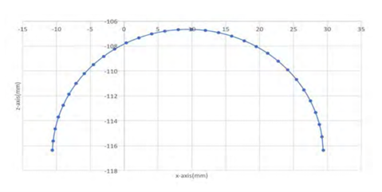  
*รูปที่ 5 Trajectory ถูกออกแบบให้เป็นรูปครึ่งวงรีเพื่อช่วยให้ปลายเท้าก้าวไปข้างหน้าได้อย่างราบรื่นบนพื้น*

การสร้างเส้นทางการเคลื่อนที่แบบ Semi-Ellipse เส้นทางการเดินของหุ่นยนต์ถูกออกแบบให้เป็นแบบครึ่งวงรี เพื่อให้ขาของหุ่นยนต์สามารถยกขึ้นและก้าวไปข้างหน้าได้อย่างมีประสิทธิภาพ เส้นทางการเดินนี้ช่วยให้หุ่นยนต์สามารถเคลื่อนที่ไปข้างหน้าได้อย่างราบรื่น โดยมีสมการดังนี้
Transfer Phase (ขากำลังก้าว)

$$
P_T = 
\begin{bmatrix}
V_F \left[ t - \frac{t_{T_0}}{2\pi} \sin \left( \frac{2\pi t}{t_{T_0}} \right) \right] \\
\frac{F_c}{2} \left[ 1 - \cos \left( \frac{2\pi t}{t_{T_0}} \right) \right]
\end{bmatrix}
$$

โดยที่

$$
V_F = \frac{L_s}{T_0}
$$

**Stance Phase (ขาหยุดนิ่ง)**

สมการของ **Stance Phase** ที่แสดงตำแหน่งของปลายขาหุ่นในช่วงเวลาหยุดนิ่งมีดังนี้

$$
P_s = 
\begin{bmatrix}
V_F T_0 \\
0
\end{bmatrix}
$$

โดยที่แต่ละตัวแปรมีความหมายดังนี้

- $( P_T )$ = ตำแหน่งของปลายขาหุ่น ณ เวลาใดๆ ในช่วง **Transfer Phase** (เมตร)
- $( P_s )$ = ตำแหน่งของปลายขาหุ่น ณ เวลาใดๆ ในช่วง **Stance Phase** (เมตร)
- $( V_F )$ = ความเร็วการเคลื่อนที่ของหุ่นยนต์ (เมตร/วินาที)
- $( L_s )$ = ความยาวที่ขาก้าวได้ใน 1 รอบขา (เมตร)
- $( T_0 )$ = จำนวนรอบใน **Gait cycle** ทั้งหมด (cycle)
- $( t )$ = เวลาใดๆ ในช่วง **Transfer Phase** (วินาที)
- $( t_{T_0} )$ = เวลาสุดท้ายของ **Transfer Phase** (วินาที)
- $( F_c )$ = ความสูงสูงสุดของก้าวแต่ละข้างที่ยกขึ้นได้ (เมตร)

สมการนี้ใช้ในการคำนวณตำแหน่งของขาหุ่นยนต์ในช่วง **Stance Phase** ซึ่งหมายถึงช่วงเวลาที่ขาหุ่นยนต์สัมผัสพื้นและหยุดนิ่งก่อนที่จะทำการยกขาขึ้นสำหรับก้าวถัดไป

### 2.5 ) การออกแบบท่าทางการเดิน (Gait Planning)
หุ่นยนต์มีการวางแผนท่าทางการเดินที่เลียนแบบท่าทางของสุนัข โดยมีการยกขาขึ้นและเคลื่อนไหวทีละขา เริ่มต้นจากขาหน้าขวา (FR) ตามด้วยขาหลังซ้าย (RL) และต่อเนื่องไปเรื่อยๆ เพื่อให้หุ่นยนต์เคลื่อนที่ไปข้างหน้าได้อย่างสมดุล

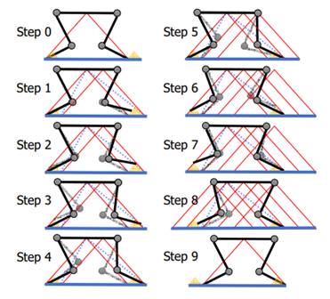  
*รูปที่ 6 มุมมองด้านข้างของรูปแบบการเดินในเก้าขั้นตอนขณะเคลื่อนที่ไปข้างหน้าบนพื้นเรียบ*

### เนื้อหาในรายวิชาที่เกี่ยวข้อง

1)	Transformation of Coordinate Frame
2)	Forward Kinematics
3)	Inverse Kinematics
4)	Trajectory Planning
5)	Robot Modelling by python

### System Diagram / System Overview (Function and Argument)  

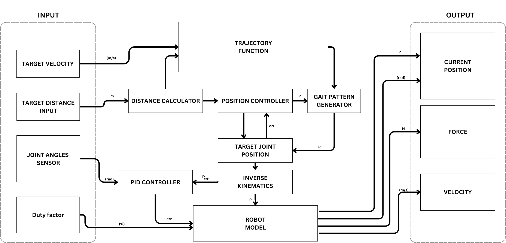  
*รูปที่ 7 แสดง System Diagram*

## **Input**

1. **Target Velocity (m/s):**  
   ความเร็วเป้าหมายที่ต้องการให้หุ่นยนต์เคลื่อนที่
2. **Target Distance (m):**  
   ระยะทางเป้าหมายที่ต้องการให้หุ่นยนต์เดิน
3. **Joint Angles (rad):**  
   มุมของข้อต่อต่างๆ ของหุ่นยนต์ จากเซ็นเซอร์ Joint Angles Sensor
4. **Duty Factor (%):**  
   อัตราส่วนของเวลาที่ขาสัมผัสพื้นเมื่อเทียบกับระยะเวลาทั้งหมดของหนึ่งรอบการเดิน


## **Output**

1. **Current Position (m):**  
   ตำแหน่งปัจจุบันของหุ่นยนต์
2. **Force (N):**  
   แรงที่กระทำต่อหุ่นยนต์ หรือแรงที่หุ่นยนต์กระทำต่อสิ่งแวดล้อม
3. **Velocity (m/s):**  
   ความเร็วปัจจุบันของหุ่นยนต์


## **ส่วนประกอบ**

### 1. **Trajectory Function**
   - **ข้อมูลนำเข้า:**
     - Target Velocity
     - Target Distance
   - **ข้อมูลส่งออก:**  
     ข้อมูล Trajectory (เช่น ตำแหน่ง ความเร็ว ความเร่ง)  
     ส่งไปยัง:
     - Gait Pattern Generator
     - Position Controller

### 2. **Distance Calculator**
   - **ข้อมูลนำเข้า:**  
     Current Position
   - **ข้อมูลส่งออก:**  
     ระยะทางที่หุ่นยนต์เคลื่อนที่ไปแล้ว ส่งไปยัง Position Controller

### 3. **Position Controller**
   - **ข้อมูลนำเข้า:**
     - ข้อมูล Trajectory
     - ระยะทางที่เคลื่อนที่ไปแล้ว
   - **ข้อมูลส่งออก:**  
     ค่า Error (ระยะทางที่เหลือ) ส่งไปยัง Gait Pattern Generator

### 4. **Gait Pattern Generator**
   - **ข้อมูลนำเข้า:**
     - ข้อมูล Trajectory
     - ค่า Error
     - Duty Factor
   - **ข้อมูลส่งออก:**  
     มุมเป้าหมายของข้อต่อ (Target Joint Position) ส่งไปยัง Inverse Kinematics

### 5. **Inverse Kinematics**
   - **ข้อมูลนำเข้า:**  
     Target Joint Position
   - **ข้อมูลส่งออก:**  
     ค่าควบคุมสำหรับ Joint Actuators (เช่น แรงบิด หรือความเร็ว) ส่งไปยัง Robot Model

### 6. **PID Controller**
   - **ข้อมูลนำเข้า:**
     - Joint Angles
     - Target Joint Position
   - **ข้อมูลส่งออก:**  
     ค่าควบคุมสำหรับ Joint Actuators เพื่อปรับแต่งค่าจาก Inverse Kinematics ให้แม่นยำยิ่งขึ้น ส่งไปยัง Robot Model

### 7. **Robot Model**
   - **ข้อมูลนำเข้า:**
     - ค่าควบคุมจาก Inverse Kinematics
     - ค่าที่ปรับแต่งจาก PID Controller
   - **ข้อมูลส่งออก:**  
     - Current Position, Force, Velocity (ส่งไปยัง Output)
     - Joint Angles (ส่งไปยัง Joint Angles Sensor)


## **ลำดับการทำงานของระบบ**

1. **Trajectory Function** สร้างเส้นทางการเคลื่อนที่ของหุ่นยนต์โดยใช้ Target Velocity และ Target Distance เป็นข้อมูลนำเข้า
2. **Position Controller** คำนวณค่า Error (ระยะทางที่เหลือ) โดยใช้ข้อมูล Trajectory และระยะทางที่เคลื่อนที่ไปแล้วจาก Distance Calculator
3. **Gait Pattern Generator** สร้างเป้าหมายมุมข้อต่อ (Target Joint Position) โดยใช้ข้อมูลจาก Trajectory, ค่า Error, และ Duty Factor
4. **Inverse Kinematics** แปลงมุมเป้าหมายของข้อต่อเป็นค่าควบคุมสำหรับ Joint Actuators
5. **PID Controller** ปรับค่าควบคุมจาก Inverse Kinematics ให้มีความแม่นยำสูงขึ้น
6. **Robot Model** ปฏิบัติตามคำสั่งควบคุมและส่งผลลัพธ์ออกเป็น:
   - ตำแหน่งปัจจุบัน (Current Position)
   - แรง (Force)
   - ความเร็ว (Velocity)
7. ข้อมูลย้อนกลับจะถูกส่งกลับไปยังเซ็นเซอร์และตัวควบคุมต่างๆ เพื่อปรับปรุงการทำงาน

### ผลการศึกษาที่คาดหวัง

1.	Toolbox ที่สามารถใช้ในการคำนวณ Kinematics ทั้ง Forward Kinematics และ Inverse Kinematics และสามารถสร้างเมริกซ์ DH Parameters ได้
2.	Toolbox ที่สามารถวางแผน Trajectory ของขาหุ่นยนต์ใน Workspace และสามารถสร้างเส้นทางการเคลื่อนไหวที่เหมาะสมใน Task space
3.	สามารถตรวจสอบสถานะ Singularities ได้
4.	Simulation สามารแสดงการเคลื่อนที่ของ Quadruped Robot ไปยังตำแหน่งที่ต้องการได้อย่างถูกต้อง

### รายละเอียดโครงการ
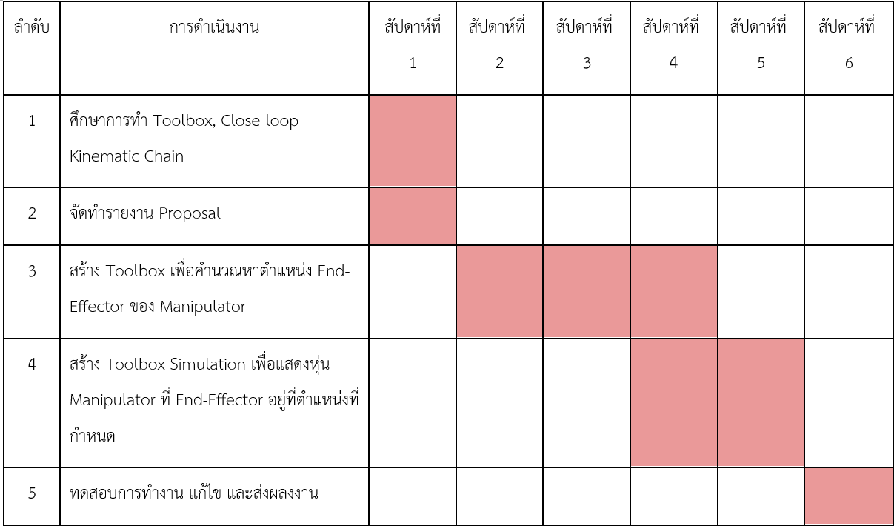  

## บทที่ 3 วิธีการดำเนินโปรเจค

ในบทนี้จะอธิบายถึงขั้นตอนการดำเนินงานในการทำโปรเจค **Quadruped Robot** โดยอิงจากจุดประสงค์และขอบเขตของโครงการ เพื่อศึกษาการเคลื่อนที่ของหุ่นยนต์ในปริภูมิ 3 มิติ การคำนวณ **Forward Kinematics**, **Inverse Kinematics**, การประยุกต์ใช้ **Kinematic** ในการหาตำแหน่ง **Task Space** ของหุ่นยนต์ และการทำ **Simulation** เพื่อศึกษาการเคลื่อนที่และการวางแผนการเคลื่อนไหว (Trajectory Planning)

### 3.1 การออกแบบและการวิเคราะห์ระบบ

**การกำหนดขอบเขตการคำนวณ**
การคำนวณ **Task Space** และการเคลื่อนที่ของ **Quadruped Robot** จะเน้นการคำนวณ **Forward Kinematics** และ **Inverse Kinematics** ของขาหุ่นยนต์แต่ละข้างในปริภูมิ 3 มิติ โดยใช้ **DH Parameters** (Denavit-Hartenberg Parameters) เพื่อหาตำแหน่งสุดท้ายของปลายขาหุ่นยนต์

1. **การคำนวณ Forward Kinematics**
   ## DH Parameters Table

   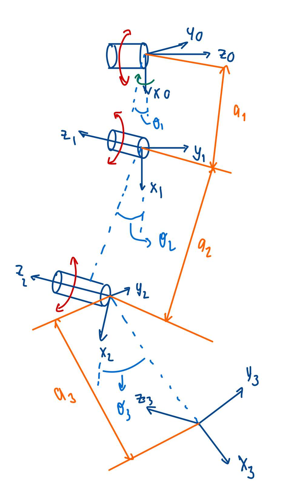  

### คำอธิบาย
- **$( a_{i-1} )$**: ความยาวของลิงค์ระหว่างข้อต่อ $( i-1 )$ และ $( i )$
- **$( d_i )$**: การเปลี่ยนแปลงเชิงเส้นในแกน $( z )$ ของข้อต่อ $( i )$
- **$( \alpha_{i-1} )$**: มุมระหว่างแกน $( z_{i-1} $) และ $( z_i )$
- **$( \theta_i )$**: มุมการหมุนที่ข้อต่อ $( i $)

### ตาราง DH Parameters สำหรับหุ่นยนต์

|    LINK    |  $( a_i-1 )$  | $( d_i )$ | $( \alpha_i-1 )$  |      $( \theta_i )$     |
|------------|---------------|-----------|-------------------|-------------------------|
| 1          |    $a_1$      |     0     | $$\frac{\pi}{2}$$ | $$-90^\circ, 90^\circ$$ |
| 2          |    $a_2$      |     0     |         0         | $$ 0^\circ, 90^\circ$$  |
| 3          |    $a_3$      |     0     |         0         | $$-180^\circ, 0^\circ$$ |

### DH Parameters

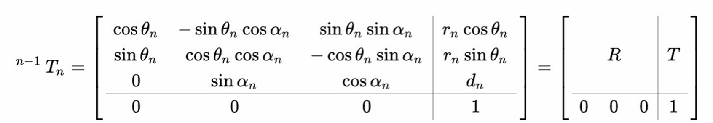  

จากนั้นจะหมุนแกน Z โดยจะหมุน $\alpha = 90^\circ$ ในแนวแกน X จะได้ผลลัพธ์ดังนี้

$$
T_1^0 =
\begin{bmatrix}
\cos \theta_1 & 0 & \sin \theta_1  & a_1 \cos \theta_1 \\
\sin \theta_1 & 0 & -\cos \theta_1  & a_1 \sin \theta_1 \\
0 & 1 & 0 & 0 \\
0 & 0 & 0 & 1
\end{bmatrix}
$$

ต่อมาจะหมุนในแนวแกน Z จะได้ผลลัพธ์ดังนี้

$$
T_2^1 =
\begin{bmatrix}
\cos \theta_2 & -\sin \theta_2  & 0 & a_2 \cos \theta_2 \\
\sin \theta_2 & \cos \theta_2  & 0 & a_2 \sin \theta_2 \\
0 & 0 & 1 & 0\\
0 & 0 & 0 & 1
\end{bmatrix}
$$

$$
T_3^2 =
\begin{bmatrix}
\cos \theta_3 & -\sin \theta_3  & 0 & a_3 \cos \theta_3 \\
\sin \theta_3 & \cos \theta_3  & 0 & a_3 \sin \theta_3 \\
0 & 0 & 1 & 0\\
0 & 0 & 0 & 1
\end{bmatrix}
$$

> **จะได้เป็น $ T_3^0 = T_1^0 * T_2^1*T_3^2 $**

ผลลัพธ์สุดท้ายของการคูณ Transformation Matrices ทั้งหมดจากเฟรมที่ 0 ไปเฟรมที่ 3 คือ

$$

T_3^0 =
\begin{bmatrix}
\cos(\theta_1)\cos(\theta_2 + \theta_3) & -\sin(\theta_2 + \theta_3)\cos(\theta_1) & \sin(\theta_1) & \cos(\theta_1)\left(a_3 \cos(\theta_2 + \theta_3) + a_2 \cos(\theta_2) + a_1 \right) \\
\sin(\theta_1)\cos(\theta_2 + \theta_3) & -\sin(\theta_2 + \theta_3)\cos(\theta_1) & \cos(\theta_1) & \sin(\theta_1)\left(a_3 \cos(\theta_2 + \theta_3) + a_2 \cos(\theta_2) + a_1 \right) \\
-\sin(\theta_2 + \theta_3) & -\cos(\theta_2 + \theta_3) & 0 & a_3 \sin(\theta_2 + \theta_3) + a_2 \sin(\theta_2) \\
0 & 0 & 0 & 1
\end{bmatrix}

$$

โดย 
$$
\begin{bmatrix}
P_x \\
P_y \\
p_z \\

\end{bmatrix}
=
\begin{bmatrix}
\cos\theta_1 \left(a_3\cos(\theta_2 + \theta_3) + a_2\cos\theta_2 + a_1\right) \\
\sin\theta_1 \left(a_3\cos(\theta_2 + \theta_3) + a_2\cos\theta_2 + a_1\right) \\
a_3\sin(theta_2 +theta_3) +a_2\sin(\theta_2 \\
\end{bmatrix}
$$

2. **การคำนวณ Inverse Kinematics**

การคำนวณ **Inverse Kinematics** (IK) จะช่วยให้เราคำนวณมุมที่ข้อต่อ $( \theta_1 )$,$( \theta_2 )$, และ $( \theta_3 )$ ของหุ่นยนต์เพื่อให้ปลายขาไปยังตำแหน่งที่ต้องการใน **3D Space** โดยมีการคำนวณจากตำแหน่งที่กำหนดไว้ของปลายขาหุ่นยนต์ในแกน $( X ), ( Y ), และ ( Z )$

# DH Parameters Table

### คำอธิบาย
- **$( a_{i-1} )$**: ความยาวของลิงค์ระหว่างข้อต่อ $( i-1 )$ และ $( i )$
- **$( d_i )$**: การเปลี่ยนแปลงเชิงเส้นในแกน $( z )$ ของข้อต่อ $( i )$
- **$( \alpha_{i-1} )$**: มุมระหว่างแกน $( z_{i-1} $) และ $( z_i )$
- **$( \theta_i )$**: มุมการหมุนที่ข้อต่อ $( i $)

### ตาราง DH Parameters สำหรับหุ่นยนต์

|    LINK    |  $( a_i-1 )$  | $( d_i )$ | $( \alpha_i-1 )$  |      $( \theta_i )$     |
|------------|---------------|-----------|-------------------|-------------------------|
| 1          |    $a_1$      |     0     | $$\frac{\pi}{2}$$ | $$-90^\circ, 90^\circ$$ |
| 2          |    $a_2$      |     0     |         0         | $$ 0^\circ, 90^\circ$$  |
| 3          |    $a_3$      |     0     |         0         | $$-180^\circ, 0^\circ$$ |


### ที่มาของตัวแปร

- **$( \theta_1, \theta_2, \theta_3 )$**: มุมการหมุนที่ข้อต่อ 1, 2, และ 3
  - **$( \theta_1 )$**: มุมหมุนที่ข้อต่อแรก (ปกติจะเกี่ยวข้องกับการหมุนในแกน $( Z ))$
  - **$( \theta_2 )$**: มุมที่เกี่ยวข้องกับการเคลื่อนที่ในแกน $( Y )$
  - **$( \theta_3 )$**: มุมที่เกี่ยวข้องกับการเคลื่อนที่ในแกน $( Z )$ สำหรับข้อต่อสุดท้าย
- $( a_1, a_2, a_3 ): ความยาวของลิงค์ระหว่างข้อต่อ$
  - $( a_1 ): ความยาวลิงค์ระหว่างข้อต่อ 0 และ 1$
  - $( a_2 ): ความยาวลิงค์ระหว่างข้อต่อ 1 และ 2$
  - $( a_3 ): ความยาวลิงค์ระหว่างข้อต่อ 2 และ 3$
- $( X, Y, Z ): ตำแหน่งของปลายขาหุ่นยนต์ใน 3D Space$
  - $( X ): ตำแหน่งในแกน ( x )$
  - $( Y ): ตำแหน่งในแกน ( y )$
  - $( Z ): ตำแหน่งในแกน ( z )$

### สมการ **Forward Kinematics**

ก่อนที่เราจะคำนวณ **Inverse Kinematics** เราต้องเข้าใจว่า **Forward Kinematics** ใช้ในการหาตำแหน่งของปลายขาหุ่นยนต์จากมุมข้อต่อที่เรารู้แล้วจากสมการ **Forward Kinematics** ที่ได้จาก **DH Parameters** คือ

- **\( P_x \)**:

$
P_x = cos\theta_1 \left(a_3\cos(\theta_2 + \theta_3) + a_2\cos\theta_2 + a_1\right)   (Equation 1)
$

- **\( P_y \)**:

$
P_y = \sin\theta_1 \left(a_3\cos(\theta_2 + \theta_3) + a_2\cos\theta_2 + a_1\right)  (Equation 2)
$

- **\( p_z \)**:

$
P_z = a_3\sin(theta_2 +theta_3) +a_2\sin(\theta_2 (Equation 3)
$


### คำนวณ $( \theta_1 ) จากตำแหน่ง ( X ) และ ( Y )$

สมการสำหรับการหามุม $( \theta_1 ) จากตำแหน่ง ( X ) และ ( Y )$ คือ

$$
X \sin(\theta_1) - Y \cos(\theta_1) = 0
$$

จากนั้น

$$
\tan(\theta_1) = \frac{\sin(\theta_1)}{\cos(\theta_1)} = \frac{Y}{X}
$$

ดังนั้น

$$
\theta_1 = \text{atan}\left(\frac{Y}{X}\right)
$$

**คำอธิบาย**
การคำนวณนี้จะหามุม $( \theta_1 ) จากตำแหน่งในแนวนอน ( X ) และ ( Y ) โดยใช้ **arctangent function** (atan) เพื่อหามุมที่เหมาะสมในแกน ( X )-( Y )$

### คำนวณ $( \theta_2 ) และ ( \theta_3 )$

ในการคำนวณ $( \theta_2 ) และ ( \theta_3 ) เราจะใช้สมการที่เกี่ยวข้องกับการคำนวณ **Inverse Kinematics** สำหรับมุมที่ 2 และ 3 สามารถหาได้ดังนี้ $

**สมการ (1)**
$$
x = a_1 \cos(\theta_1) + a_2 \cos(\theta_1 + \theta_2) + a_3 \cos(\theta_1 + \theta_2 + \theta_3)
$$
**สมการ (2)**
$$
y = \sin(\theta_1) \left(a_3 \cos(\theta_2 + \theta_3) + a_2 \cos(\theta_2) + a_1 \right)
$$
จัดรูปสมการที่ 1 และ สมการที่ 2 ให้อยู่ในรูปของ $( \cos(\theta_2 + \theta_3) )$ เพื่อใช้ในการวิเคราะห์ **Inverse Kinematics** หรือการหามุมข้อต่อจากตำแหน่งที่ปลายขาหุ่นยนต์ต้องการไปถึงใน **3D Space**

**1.จัดรูปสมการ (1)**

สมการ (1) คือการหาตำแหน่งในแกน $( x )$ จากมุมที่ข้อต่อ $( \theta_1 )$, $( \theta_2 )$, และ $( \theta_3 )$ โดยมีขั้นตอนการจัดรูปดังนี้

- ย้ายพจน์ที่ $( a_1 \cos(\theta_1) $) และ $( a_2 \cos(\theta_1 + \theta_2) )$ ไปทางซ้าย:
$$
x - a_1 \cos(\theta_1) - a_2 \cos(\theta_1 + \theta_2) = a_3 \cos(\theta_1 + \theta_2 + \theta_3)
$$

- ยกกำลังสองทั้งสองข้าง:
$$
\left(x - a_1 \cos(\theta_1) - a_2 \cos(\theta_1 + \theta_2)\right)^2 = \left(a_3 \cos(\theta_1 + \theta_2 + \theta_3)\right)^2
$$

- กระจายกำลังสองทางซ้ายของสมการ:
$$
x^2 + a_1^2 \cos^2(\theta_1) + a_2^2 \cos^2(\theta_1 + \theta_2) - 2xa_1 \cos(\theta_1) - 2xa_2 \cos(\theta_1 + \theta_2) + 2a_1 a_2 \cos(\theta_1) \cos(\theta_1 + \theta_2) = a_3^2 \cos^2(\theta_1 + \theta_2 + \theta_3)
$$


**2.จัดรูปสมการ (2)**

- หารทั้งสองข้างของสมการด้วย $(\sin(\theta_1)$ (กำหนดให้ $(\sin(\theta_1 != 0)$:
$$ \frac{y}{{sin\theta}_1}={a}_3cos(\theta2+\theta3)+{a}_2{cos\theta}_2+{a}_1 $$

- ย้ายข้างพจน์  $a_1 และ  a_2\cos(\theta_2)$ ไปทางซ้ายของสมการ:
$$ \frac{y}{{sin\theta}_1}-{a}_1-{a}_2{cos\theta}_2={a}_3cos(\theta2+\theta3) $$

- คูณทั้งสองข้างด้วยด้วย $( \sin(\theta_1) )$:
$$
y - a_1 \sin(\theta_1) - a_2 \sin(\theta_1) \cos(\theta_2) = a_3 \sin(\theta_1) \cos(\theta_2 + \theta_3)
$$

- ยกกำลังสองทั้งสองข้าง:
$$
\left(y - a_1 \sin(\theta_1) - a_2 \sin(\theta_1) \cos(\theta_2)\right)^2 = \left(a_3 \sin(\theta_1) \cos(\theta_2 + \theta_3)\right)^2
$$

- กระจายกำลังสองทางซ้ายของสมการ:
$$
y^2 + a_1^2 \sin^2(\theta_1) + a_2^2 \sin^2(\theta_1) \cos^2(\theta_2) - 2ya_1 \sin(\theta_1) - 2ya_2 \sin(\theta_1) \cos(\theta_2) + 2a_1 a_2 \sin^2(\theta_1) \cos(\theta_2) = a_3^2 \sin^2(\theta_1) \cos^2(\theta_2 + \theta_3)
$$

**3.นำสมการที่ได้จากขั้นตอนที่ 1 และ 2 มาบวกกัน**

นำสมการที่ได้จากขั้นตอนที่ 1 และ 2 มาบวกกัน  จะสังเกตว่าพจน์ $a_3^2 \cos^2(\theta_1 + \theta_2 + \theta_3)  $ และ  $a_3^2 \sin^2(\theta_1) \cos^2(\theta_2 + \theta_3)$  สามารถนำมารวมกันได้  โดยใช้เอกลักษณ์ตรีโกณมิติ \( \cos^2(\alpha) + \sin^2(\alpha) = 1 \)

- ใช้เอกลักษณ์ตรีโกณมิติ $( \cos(\alpha + \beta) = \cos(\alpha) \cos(\beta) - \sin(\alpha) \sin(\beta) )$ และ $( \sin(\alpha + \beta) = \sin(\alpha) \cos(\beta) + \cos(\alpha) \sin(\beta) )$ เพื่อแปลงพจน์ $(\cos(\theta_1 + \theta_2))$ และ $( \sin(\theta_1) \cos(\theta_2) )$ :
$$
a_3^2 \cos^2(\theta_2 + \theta_3) = x^2 + y^2 + a_1^2 + a_2^2 - 2x a_1 \cos(\theta_1) - 2y a_1 \sin(\theta_1) - 2x a_2 (\cos(\theta_1) \cos(\theta_2) - \sin(\theta_1) \sin(\theta_2)) - 2y a_2 (\sin(\theta_1) \cos(\theta_2) + \cos(\theta_1) \sin(\theta_2)) + 2a_1 a_2 \cos(\theta_1) (\cos(\theta_1) \cos(\theta_2) - \sin(\theta_1) \sin(\theta_2)) + 2a_1 a_2 \sin^2(\theta_1) \cos(\theta_2)
$$

- จัดรูปสมการ
$$
a_3^2 \cos^2(\theta_2 + \theta_3) = x^2 + y^2 + a_1^2 + a_2^2 - 2a_1 (x \cos(\theta_1) + y \sin(\theta_1)) - 2a_2 (x \cos(\theta_1) + y \sin(\theta_1)) \cos(\theta_2) + 2a_1 a_2 \cos(\theta_2)
$$

- ดึงตัวร่วม  $(x\cos(\theta_1 + (y\sin(\theta_1)$ ออกมา
$$
a_3^2 \cos^2(\theta_2 + \theta_3) = x^2 + y^2 + a_1^2 + a_2^2 - 2(x \cos(\theta_1) + y \sin(\theta_1))(a_1 + a_2 \cos(\theta_2)) + 2a_1 a_2 \cos(\theta_2) 
$$

**4.จัดรูปสมการให้อยู่ในรูปของ $( \cos(\theta_2 + \theta_3) $)**

- หารทั้งสองข้างของสมการด้วย $-2(a_1 + a_2 \cos(\theta_2))$ :
$$
x \cos(\theta_1) + y \sin(\theta_1) = \frac{x^2 + y^2 + a_1^2 + a_2^2 + 2a_1 a_2 \cos(\theta_2) - a_3^2 \cos^2(\theta_2 + \theta_3)}{-2(a_1 + a_2 \cos(\theta_2))}
$$

- คูณทั้งสองข้างของสมการด้วย $a_3$ :
$$
a_3(x \cos(\theta_1) + y \sin(\theta_1)) = \frac{a_3(x^2 + y^2 + a_1^2 + a_2^2 + 2a_1 a_2 \cos(\theta_2) - a_3^2 \cos^2(\theta_2 + \theta_3))}{-2(a_1 + a_2 \cos(\theta_2))}
$$

- จัดรูปสมการ 
$$
a_3 ( x \cos(\theta_1) + y \sin(\theta_1) ) - a_3 ( a_1 + a_2 \cos(\theta_2) ) = - \frac{a_3^3 \cos^2(\theta_2 + \theta_3)}{2 ( a_1 + a_2 \cos(\theta_2) )} + \frac{a_3 ( x^2 + y^2 - a_1^2 - a_2^2 )}{2 ( a_1 + a_2 \cos(\theta_2) )}
$$

- ดึงตัวร่วม $a_3$ :
$$
a_3 ( x \cos(\theta_1) + y \sin(\theta_1) ) -  a_1 - a_2 \cos(\theta_2)  = - \frac{a_3^3 \cos^2(\theta_2 + \theta_3)}{2 ( a_1 + a_2 \cos(\theta_2) )} + \frac{a_3 ( x^2 + y^2 - a_1^2 - a_2^2 )}{2 ( a_1 + a_2 \cos(\theta_2) )}
$$

- คูณทั้งสองข้างของสมการด้วย $- \frac{2 (a_1 + a_2 \cos(\theta_2))}{a_3^3}$:
$$
- \frac{2 (a_1 + a_2 \cos(\theta_2))}{a_3^2}( x \cos(\theta_1) + y \sin(\theta_1) ) -  a_1 - a_2 \cos(\theta_2) = ( \cos^2(\theta_2 + \theta_3) - \frac{( x^2 + y^2 - a_1^2 - a_2^2 )}{a_3^2}
$$

$$
- \frac{2 (a_1 + a_2 \cos(\theta_2))}{a_3^2}( x \cos(\theta_1) + y \sin(\theta_1) ) -  a_1 - a_2 \cos(\theta_2) + \frac{( x^2 + y^2 - a_1^2 - a_2^2 )}{a_3^2} = ( \cos^2(\theta_2 + \theta_3)
$$

- จัดรูปสมการ :
$$
( \cos^2(\theta_2 + \theta_3) = (\frac{x \cos(\theta_1) + y \sin(\theta_1) ) -  a_1 - a_2 \cos(\theta_2)^2}{a_3^2}
$$

- ถอดรากที่สองทั้งสองข้างของสมการ: 

**Equation 4**

$$
\cos(\theta_2 + \theta_3) = \frac{X \cos(\theta_1) + Y \sin(\theta_1) - a_2 \cos(\theta_2) - a_1}{a_3} \tag{4}
$$

- สมการนี้จะมาจากการพิจารณาการแปลงตำแหน่งของปลายขาในแกน **XY**ก็คือสมการที่ 1 และ 2 ที่เป็น Forward Kinematics หลังจากที่เราได้คำนวณมุม $( \theta_1 )$ แล้ว
จากสมการ $ P_z = 𝑎_3\sin(theta_2 +theta_3) +𝑎_2\sin(\theta_2 $ (Equation 3) นำมาจัดรูปใหม่จะได้ :

- **Equation 5**:

$$
\sin(\theta_2 + \theta_3) = \frac{z - a_2 \sin(\theta_2)}{a_3} \tag{5}
$$

- สมการนี้มาจากการพิจารณาการแปลงตำแหน่งของปลายขาในแกน **Z** ก็คือสมการที่ 3 ที่เป็น Forward Kinematics จะใช้ $( \sin^2(\theta) + \cos^2(\theta) = 1 )$ เนื่องจาก $( \sin^2(\theta) + \cos^2(\theta) = 1 )$, เราสามารถแทนค่าจากสมการที่ 4 และ 5 ได้ดังนี้

$$
{x}^2{cos}^2{\theta}_1+{y}^2{sin}^2{\theta}_1+{{a}_1}^2+{{{a}_2}}^2{cos}^2{\theta}_2+zxycos{\theta}_1sin{\theta}_1-2{a}_1xcos{\theta}_1cos{\theta}_2-2{a}_1{a}_2cos{\theta}_2+z-2z{a}_2sin{\theta}_2+{{a}_2}^2sin{\theta}_2={{a}_3}^2
$$

- จัดรูปสมการ
$$
x^2 \cos^2(\theta_1) + y^2 \sin^2(\theta_1) + a_1^2 + a_2^2 \cos^2(\theta_2) + z x y \cos(\theta_1) \sin(\theta_1) - 2 a_1 x \cos(\theta_1) \cos(\theta_2) - 2 a_1 a_2 \cos(\theta_2) + z - 2 z a_2 \sin(\theta_2) + a_2^2 \sin^2(\theta_2) = a_3^2
$$

- จากนั้นจัดสมการให้อยู๋ในรูป $A \sin(\theta) + B \cos(\theta) = C $

   - $( A = -2 z a_2 )$
   - $( B = -2 X a_2 \cos(\theta_1) - 2 Y a_2 \sin(\theta_1) + 2 a_1 a_2 )$
   - $( C = {a_3}^2-{x}^2{cos}^2{\theta}_1-2xycos{\theta}_1sin{\theta}_1+2{a}_1xcos{\theta}_1-{y}^2{sin}^2{\theta}_1+2{a}_1ysin{\theta}_1-{z}^2-{{a}_1}^2-{{a}_2}^2 $

   จะได้
   - $( A = r \cos(\alpha) )$
   - $( B = r \sin(\alpha) )$

   โดยที่
   - $( r^2 = \pm \sqrt{A^2 + B^2} )$
   - $( \alpha = \text{atan}\left(\frac{B}{A}\right) )$

จะได้ 
$$
r \sin(\theta_2 + \alpha) = C
$$

$$
\theta_2 + \alpha = \arcsin(\frac{C}{r})
$$

$$
\theta_2 = \arcsin\left(\frac{C}{r}\right) - \tan^{-1}\left(\frac{B}{A}\right)
$$

$$
\tan((\theta_2 + \theta_3)) = \frac{\sin(\theta_2 + \theta_3)}{\cos((\theta_2 + \theta_3)}
$$

$$
\tan(\theta_2 + \theta_3) = \frac{\frac{z - a_2 \sin(\theta_2)}{a_3}}{\frac{x \cos(\theta_1) + y \sin(\theta_1) - a_1 - a_2 \cos(\theta_2)}{a_3}}
$$


$$
(\theta_2 + \theta_3) = \tan^{-1} \left( \frac{z - a_2 \sin(\theta_2)}{x \cos(\theta_1) + y \sin(\theta_1) - a_1 - a_2 \cos(\theta_2)} \right)
$$


$$
\theta_3 = \tan^{-1} \left( \frac{z - a_2 \sin(\theta_2)}{x \cos(\theta_1) + y \sin(\theta_1) - a_1 - a_2 \cos(\theta_2)} \right) - \theta_2
$$


### 3.2 การทำ GUI Trajectory

1. **GUI Trajectory Planning**:
 >**INPUT**
- **Duty Factor** เป็นส่วนของ Gait Cycle ซึ่งหมายถึงการเคลื่อนไหวของขาหนึ่งรอบ (ตั้งแต่ขาสัมผัสพื้นครั้งแรกจนกลับมาสัมผัสพื้นอีกครั้ง) โดยค่าที่จำเป็นสำหรับการตั้งค่าในระบบ Simulation มีดังนี้:

      - **B = 1**: หุ่นยนต์อยู่ในสถานะยืนนิ่ง
      - **B = 0.3 – 0.75**: หุ่นยนต์อยู่ในสถานะเดิน

ผู้ใช้งานสามารถปรับค่า \( B \) ได้ภายในช่วงที่กำหนด เพื่อจำลองพฤติกรรมที่แตกต่างกันของหุ่นยนต์ใน Simulation

- **Frontal Velocity** คือความเร็วในการเคลื่อนที่ของหุ่นยนต์ในแนวราบ โดยผู้ใช้งานสามารถกำหนดค่าได้ในหน่วย **เมตรต่อวินาที (m/s)** ตามความต้องการ

- **Distance** หมายถึงระยะทางที่หุ่นยนต์เคลื่อนที่ ผู้ใช้งานสามารถกำหนดค่าได้ในหน่วย **เมตร (m)** เพื่อระบุระยะทางที่ต้องการให้หุ่นยนต์เดินหรือเคลื่อนไหวใน Simulation

## การตั้งค่าพารามิเตอร์
ตัวอย่างการตั้งค่าพารามิเตอร์ในระบบ Simulation:
- หากต้องการให้หุ่นยนต์ยืนนิ่ง:  
  `B = 1`, Frontal Velocity = `0`, Distance = `0`
- หากต้องการให้หุ่นยนต์เดินด้วยความเร็วปานกลาง:  
  `B = 0.5`, Frontal Velocity = `0.8`, Distance = `10`
## Installment
> 1. Open Visual Studio Code.
> 2. Go to the terminal or open a new terminal.
> 3. Copy and paste the following command:
>    ```bash
>    pip install tkinter
>    ```
> 4. Press Enter and wait for the download to complete.

[](https://youtu.be/HdOScgHzM_g?si=699VRjN-CH8wouwy)

คลิกที่ภาพเพื่อดูวิดีโอ


 >**FIND TRAJECTORY**

  Variables
- **$T_o$**: เวลาของรอบการทำงาน (Cycle Time)  
- **$V_F$**: Frontal Velocity (m/s) หรือ ความเร็วการเคลื่อนที่ในแนวราบ  
- **$L$**: ระยะก้าวของขาหนึ่งข้าง  
- **$t_{T0}$**: เวลาของเฟสการถ่ายโอน (Transfer Phase Time)
- **Duty Factor (B)**: อัตราส่วนของเวลาที่ขาสัมผัสพื้นในหนึ่งรอบการเคลื่อนไหว  
- **$F_c$**: ความสูงสูงสุดที่ขาหุ่นยนต์สามารถทำได้  
- **$t_s$**: เวลาที่ขาหยุดนิ่ง

จากนั้นจะคำนวณ Trajectory แบบ Periodic

การเคลื่อนที่แบบ Periodic ในหุ่นยนต์ Quadruped Robot หมายถึงการเคลื่อนที่ที่มีลักษณะการทำงานเป็นช่วงๆ ซึ่งเกิดขึ้นซ้ำๆ ในระยะเวลาที่เท่ากันทุกรอบ โดยจะมีการเคลื่อนที่ในแต่ละรอบที่สามารถกำหนดได้ชัดเจนในแง่ของตำแหน่งขา ความเร็ว และทิศทาง

การเคลื่อนที่แบบ Periodic จะเกี่ยวข้องกับการควบคุมการยกขา (Swing Phase) และการลงขา (Stance Phase) ในระหว่างการเดินของหุ่นยนต์ โดยในแต่ละรอบ (Cycle) ขาหุ่นยนต์จะทำการเคลื่อนที่ซ้ำกันในลักษณะเ

  
*รูปที่ 14 Cycloid Trajectory*

จากสูตร


$$ P_{r}=\left\lbrack{V}_{F}\left\lbrack t-\frac{{T}_{{T}_0}}{2\pi}\sin\left(\frac{2\pi t}{{t}_{{T}_0}}\right)\right\rbrack,\frac{{F}_{c}}{2}\left\lbrack1-\cos\left(\frac{2\pi t}{{t}_{{T}_0}}\right)\right\rbrack\right\rbrack^{T} $$

$$ P_{s}={\left\lbrack{V}_{F}{T}_0,0\right\rbrack}^{T} $$

กำหนดให้
- Xmax: Forward Kinematic ของแกน X ในกรณีที่ขามีองศาในการหมุนทุก Joint  
- L: ความยาว Link ที่เชื่อมต่อระหว่าง DOF ของขาหุ่นยนต์  

จะสามารถหาระยะก้าวของขา 1 ข้าง ($L_s$) ได้จากสูตร Forward Kinematic

$
X_{\text{max}} = L_1 \cos{0^\circ} + L_2 \cos{0^\circ}
$

$
L_s = 2 X_{\text{max}}
$

จากนั้นจะหา Stance Phase Duration ($t_s$) ได้จากสูตร

$$ t_{s}=\frac{L_{s}}{{V}_{F}} $$

ต่อมาหา เวลาของรอบการทำงาน ($T_0$) ได้จากสูตร

$$ T_0=\frac{t_{s}}{\beta} $$

กำหนดให้ k : ค่า Constant ที่ขึ้นอยู่กับ Design ของหุ่น ในที่นี้มีค่าเท่ากับ 0.05-0.1 (หุ่นยนต์เดิน)

ถัดมาจะหาค่าของ Transfer Phase Duration ($t_{T0}$) ได้จากสูตร

$$ t_{{T}_0}={T}_0-{t}_{s} $$

ต่อมาจะหาความสูงสูงสุดที่ขาหุ่นสามารถทำได้ ($F_c$) ได้จากสูตร

$$ F_{c}=k{L}_{s} $$

จากนั้นจะนำค่าที่หาได้ทั้งหมด มาคำนวณหาค่า Transfer Phase ($P_T$)  คือ ขาหุ่นกำลังก้าว

จากสูตร 

$$ P_{T}=\begin{bmatrix}{{V}_{F}}\left\lbrack t-\frac{{t}_{{T}_0}}{2\pi}\sin\left(\frac{2\pi t}{{t}_{{T}_0}}\right)\right\rbrack\\ \frac{{F}_{c}}{2}\left\lbrack1-\cos\left(\frac{2\pi t}{{t}_{{T}_0}}\right)\right\rbrack\end{bmatrix} $$

ผลลัพธ์

$$ P_{T}=\left\lbrack\begin{matrix}{X}\\ 0\\ Z\end{matrix}\right\rbrack $$ 
**ผลลัพธ์ที่ได้จะไม่มีแกน Y เพราะหุ่นยนต์เดินเป็นเส้นตรง**

จากนั้นจะนำค่าที่หาได้ทั้งหมด มาคำนวณหาค่า Stance Phase ($P_s$) คือ ขาหยุดนิ่ง

จากสูตร

$$ P_{s}=\begin{bmatrix}{{V}_{F}}{T}_0\\ 0\end{bmatrix} $$

**ในขั้นตอนสุดท้ายนำค่าทั้งหมดที่หาได้ไปแทนใน Inverse Kinematic**

 >**OUTPUT**

 - กราฟ 3D ของ Cycloid Trajectory แบบ Periodic Motion แสดงการเคลื่อนที่ของหุ่นยนต์

 - ข้อมูล Stance Phase และ Transfer Phase ณ เวลาใด ๆ

 - Posotion X และ Z ของขาหุ่นยนต์

 2. **การคำนวณ Task Space**:
   - ใช้ข้อมูลจากการคำนวณ **Forward Kinematics และ Inverse Kinematics** เพื่อนำไปคำนวณ **Task Space** ของหุ่นยนต์ในแต่ละขั้นตอน
   
   จากสูตร 


### 3.3 การใช้ **Simulation** เพื่อทดสอบการเคลื่อนที่

ในขั้นตอนนี้จะทำการใช้ **Simulation** เพื่อลองทดสอบการคำนวณเพื่อหา **Task Space** และการเคลื่อนที่ของหุ่นยนต์ในสภาพแวดล้อมเสมือนจริง เพื่อให้เห็นผลลัพธ์การเคลื่อนที่และตรวจสอบความถูกต้องของการคำนวณ

1. **การทดสอบใน **Simulation**:
   - ทำการจำลองการเคลื่อนที่ของหุ่นยนต์ในปริภูมิ 3 มิติ โดยการใช้ซอฟต์แวร์ **Simulation** เพื่อให้เห็นการเคลื่อนที่ในพื้นที่การทำงาน
   - ทดสอบการคำนวณ **Trajectory** ของหุ่นยนต์และการเคลื่อนที่ใน **Task Space** โดยการสมมติ Duty Factor, Frontal Velocity, Distance

## บทที่ 4 ผลลัพธ์

  1. ผลลัพธ์การจำลองการเคลื่อนที่ของหุ่นยนต์ในปริภูมิ 3 มิติ
โดยใช้ระบบการจำลองการเคลื่อนที่ของหุ่นยน์เพื่อให้เห็นพื้นที่การทำงานโดยรวม

//  ใส่คลิปวิดีโอ RobotMoving.mp4

2. ผลลัพธ์การจำลองกากรเคลื่อนที่ของขาหุ่นยนต์เพื่อเเสดงขอบเขตพื้นที่การทำงานของขาหุ่นยนต์ 1 ข้าง
- ขอบเขตพื้นที่การทำงานในแต่ละแกน:
  - แกน X: 0.029 - 0.370 เมตร
  - แกน Y: 0.099 - 0.100 เมตร
  - แกน Z: 0.001 - 0.129 เมตร
  - รัศมีสูงสุด: 0.405 เมตร
  - ความสามารถในการเคลื่อนที่ในแนวแกน Z: 0.129 เมตร


  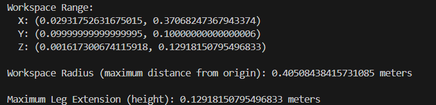 
    


  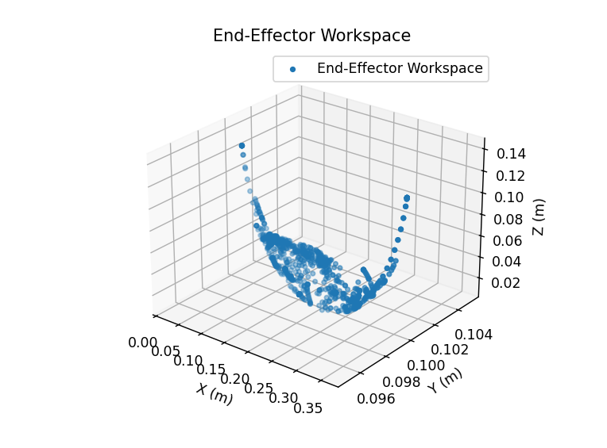
  
3. ผลลัพธ์การทดสอบการคำนวณ Trajectory ของหุ่นยนต์และการเคลื่อนที่ใน Task Space โดยกำหนด Duty Factor, Frontal Velocity และ Distance เพื่อประเมินความแม่นยำและประสิทธิภาพในการเคลื่อนที่ไปยังตำแหน่งเป้าหมาย

  - ผลลัพธ์กราฟ Trajectory จากการเคลื่อนที่ของขาหุ่นยนต์อ 1 ก้าว เพื่อสังเกตดังต่อไปนี้
    - **ความเร็วการเคลื่อนที่ของหุ่นยนต์ :**
      
        ค่าความเร็วมีการเปลี่ยนเเปลงตลอดเวลา โดยจะมีช่วงที่ความเร็วเพิ่มขึ้นเเละลดลงสลับกันเพื่อให้เหมาะสมต่อการเดินไปยังเป้าหมาย
    - **ความเร่งที่ใช้ในการเคลื่อนทื่ของหุ่นยนต์ :**

        ความเร่งมีลักษณะการสั่นที่ขึ้นลง ที่เเสดงให้เห็นถึงการควบคุมเเพื่อเพิ่มความเร็ว เเละ ลดความเร็วลง

    - **ตำเเหน่งที่ขาของหุ่นยนต์หยุดนิ่ง :**
    
        จากในกราฟเเสดงตำเเหน่งที่ขาเริ่มจากก้าวเเรกอยู่ที่ 0.17 เมตร เเละเคลื่อนที่อย่างต่อเนื่องจนถึงช่วงประมาณ 0.1 เมตร หรือเทียบจากระยะก้าวที่เหมาะสมของขาหุ่นยนต์ที่ 0.08 เมตร ซึ่งถ้าเทียบกับที่เดินได้ 0.17 เมตร ซึ่งเมื่อเทียบเป้าหมายที่ถึง 0.1 เมตร เเสดงให้เห็นความเเม่นยำของการวางขาหุ่นยนต์ที่คลาดเคลื่อนเพียง 0.01 เมตร เเสดงถึงความเเม่นยำในการวางขา

      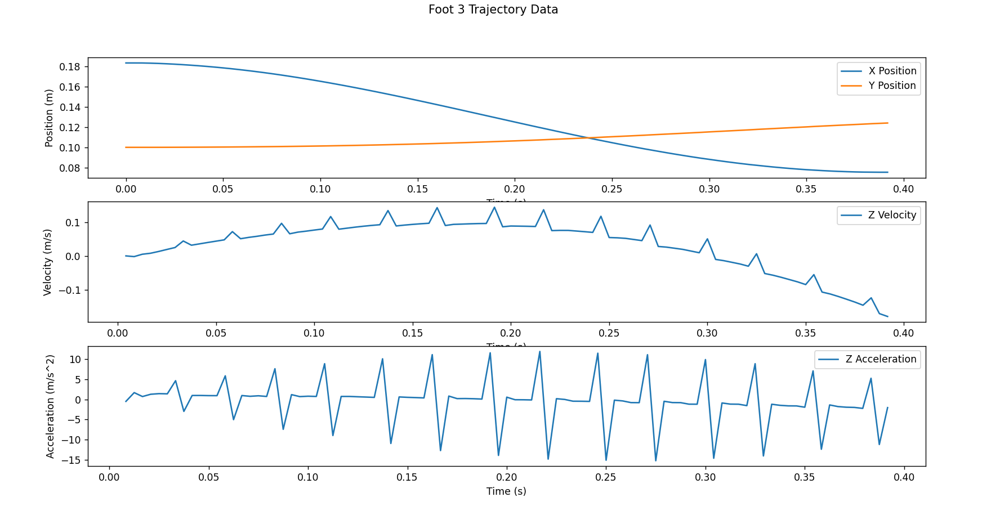

  **ผลลัพธ์เมื่อหุ่นยนต์เคลื่อนที่ตามตำเเหน่งเป้าหมายที่ต้องการในช่วงระยะทางต่างๆ โดยเเบ่งการทดลองเป็น 3ชุด คือ ระยะทาง 0.8, 1.5, 2.0 เมตร เเละ ให้ Duty Cycle เป็นสูงสุด เเละ ความเร็วในการเคลื่อนที่สูงสุด**
  
  - **ผลลัพธ์ในระยะที่ 0.8 เมตร**    
    - **ระยะทางที่เคลื่อนที่เทียบกับเป้าหมาย** :   
    จากการเเสดงค่าความคลาดเคลื่อนใน GUI ที่อยู่ที่ประมาณ 0.05 เมตร ซึ่งค่อนข้างมีความใกล้เคียงกับเป้าหมายที่ต้องไว้ เเต่ก็ยังคงเป็นค่าความคลาดเคลื่อนที่ค่อนข้างสูง
    -  ความเร็วในการเคลื่อนที่ :  
    จากเส้นกราฟมีลักษณะเป็นคลื่น แสดงว่าการเคลื่อนที่ของหุ่นยนต์ไม่ได้ราบเรียบ แต่มีการสั่นสะเทือนเกิดขึ้นระหว่างการเคลื่อนที่

 

  
  - **ผลลัพธ์ในระยะที่ 1.5 เมตร**    
    - **ระยะทางที่เคลื่อนที่เทียบกับเป้าหมาย** :   
    จากการเเสดงค่าความคลาดเคลื่อนใน GUI ที่อยู่ที่ประมาณ 0.06 m ซึ่งยังเป็นค่าคลาดเคลื่อนที่อยู่ในเกณฑ์ที่รับได้

    -  ความเร็วในการเคลื่อนที่ :  
    สังเกตได้ว่ามีความเร็วเฉลี่ยในการเคลื่อนที่จะใกล้เคียงกัน เมื่อเทียบจากกราฟการเคลื่อนที่ในระยะ 0.8  อาจวิเคราะห์ได้ว่าหุ่นยนต์ในกราฟที่สอง เริ่มต้นด้วยความเร็วที่ต่ำกว่ากราฟแรกเล็กน้อย และมีความเร็วค่อนข้างคงที่ตลอดช่วงเวลา ซึ่งต่างจากกราฟแรกที่ความเร็วลดลงอย่างเห็นได้ชัดในช่วงหลัง

      


   - **ผลลัพธ์ในระยะที่ 2.0 เมตร**    
      - **ระยะทางที่เคลื่อนที่เทียบกับเป้าหมาย** :   
      จากการเเสดงค่าความคลาดเคลื่อนใน GUI ที่อยู่ที่ประมาณ 0.06 เมตร ซึ่งยังเป็นค่าคลาดเคลื่อนที่อยู่ในเกณฑ์ที่รับได้เเละมีความเเม่นยำที่ดี
    
      - ความเร็วในการเคลื่อนที่ :
      ความเร็วเฉลี่ยในการเคลื่อนที่ของทั้งสามกราฟใกล้เคียงกัน แต่ลักษณะการเปลี่ยนแปลงความเร็วแตกต่างกัน โดยกราฟแรกเริ่มต้นด้วยความเร็วสูงแล้วค่อยๆ ลดลง กราฟที่สองมีความเร็วค่อนข้างคงที่ ส่วนกราฟที่สามดูเหมือนจะมีช่วงที่ความเร็วเพิ่มขึ้นเล็กน้อยในช่วงกลางของการเคลื่อนที่

      


**ผลลัพธ์เมื่อมีการปรับ Duty Cycle สมมติให้เเก่หุ่นยนต์เพื่อเคลื่อนที่ตามตำเเหน่งเป้าหมายที่ต้องการ โดยเเบ่งชุดการทดลองเป็นดังนี้ Duty Cycle 0.2, 0.5, 1.0 ให้ค่าความเร็วคงที่ 1.0 เมตรต่อวินาที เเละ ตำเเหน่งระยะทางที่ต้องการ 0.2 เมตร**

   - **ผลลัพธ์ในเมื่อปรับค่า Duty cycle ที่ 0.2**    
      - **ระยะทางที่เคลื่อนที่เทียบกับเป้าหมาย** :   
      จากการเเสดงค่าความคลาดเคลื่อนใน GUI ที่อยู่ที่ประมาณ 0.06 เมตร
    
      -  ความเร็วในการเคลื่อนที่ของหุ่นยนต์ :  
 ความเร็วในการเคลื่อนจากกราฟที่เเสดงนี้ เเสดงได้ว่า มีความเร็วในการเคลื่อนที่ที่ค่อนข้างต่ำ ซึ่งอาจเป็นผลมาจาก Duty Factor ที่ต่ำ
      - เวลาที่ใช้ในการเคลื่อนที่: แม้จะเป็นระยะทางที่สั้นที่สุด แต่หุ่นยนต์ใช้เวลาในการเคลื่อนที่นานกว่ากราฟก่อนหน้ามาก ซึ่งน่าจะเกิดจากความเร็วที่ต่ำกว่า

      


   - **ผลลัพธ์ในเมื่อปรับค่า Duty cycle ที่ 0.5**    
      - **ระยะทางที่เคลื่อนที่เทียบกับเป้าหมาย** :   
      จากการเเสดงค่าความคลาดเคลื่อนใน GUI ที่อยู่ที่ประมาณ 0.06 เมตร
    
      -  ความเร็วในการเคลื่อนที่ของหุ่นยนต์ : ความชันของกราฟมีค่ามากกว่ากราฟของ Duty Cycle ที่ 0.2 ก่อนหน้าเล็กน้อย แสดงว่าหุ่นยนต์เคลื่อนที่ด้วยความเร็วสูงกว่า และดูเหมือนว่าความเร็วจะค่อนข้างคงที่ตลอดช่วงเวลา 
      - เวลาที่ใช้ในการเคลื่อนที่: เวลาที่ใช้ในการเคลื่อนที่สั้นกว่าของกราฟที่ใช้ Duty Cycle 0.2

      

   - **ผลลัพธ์ในเมื่อปรับค่า Duty cycle ที่ 1.0**    
      - **ระยะทางที่เคลื่อนที่เทียบกับเป้าหมาย** :   
      จากการเเสดงค่าความคลาดเคลื่อนใน GUI ที่อยู่ที่ประมาณ 0.06 เมตร
    
      -  ความเร็วในการเคลื่อนที่ของหุ่นยนต์ :  
 ความชันของกราฟมีค่าสูงสุดเมื่อเทียบกับกราฟก่อนหน้า แสดงว่าหุ่นยนต์เคลื่อนที่ด้วยความเร็วสูง และความเร็วมีการเปลี่ยนแปลงตลอดเวลา มีช่วงที่ความเร็วเพิ่มขึ้นและลดลงสลับกันไปมา
      - เวลาที่ใช้ในการเคลื่อนที่: หุ่นยนต์ใช้เวลาประมาณ 1.6 วินาที ในการเคลื่อนที่ 0.2 เมตร ซึ่งเร็วกว่ากราฟที่มี Duty Factor 0.5 และ 0.2 มากเเละ กราฟมีลักษณะเป็นคลื่นเเบบชัดเจน แสดงว่ามีการสั่นสะเทือนเกิดขึ้นระหว่างการเคลื่อนที่ และแอมพลิจูดของคลื่นมากกว่ากราฟที่มี Duty Factor ต่ำกว่าทั้ง 0.2 เเละ 0.5 

      


## บทที่ 5 สรุปเเละวิเคราะห์ผล

  - **สรุปเเละวิเคราะห์ผลเมื่อหุ่นยนต์เคลื่อนที่ตามตำเเหน่งเป้าหมายที่ต้องการในช่วงระยะทางต่างๆ โดยเเบ่งการทดลองเป็น 3ชุด คือ ระยะทาง 0.8, 1.5, 2.0 เมตร**
    - **ความแม่นยำในการเคลื่อนที่** :
        -  หุ่นยนต์สามารถเคลื่อนที่ไปถึงตำแหน่งเป้าหมายค่อนข้างแม่นยำในทุกระยะทางที่กำหนดไว้
  เเละพบค่าความคลาดเคลื่อนระหว่างระยะทางเคลื่อนที่จริงกับระยะทางเป้าหมายมีเพียงเล็กน้อย (ประมาณ 0.05 - 0.06 เมตร) ซึ่งถือว่าอยู่ในเกณฑ์ที่ยอมรับได้

    - **ลักษณะการเคลื่อนที่**:

      - **ระยะทาง 0.8 เมตร**: หุ่นยนต์เริ่มต้นด้วยความเร็วสูงมาก แล้วค่อยๆ ลดความเร็วลงจนกระทั่งหยุด ลักษณะการเคลื่อนที่มีการสั่นสะเทือนค่อนข้างมาก


      - **ระยะทาง 1.5 เมตร**: หุ่นยนต์เคลื่อนที่ด้วยความเร็วค่อนข้างคงที่ตลอดช่วงเวลา สังเกตได้ว่ามีความเร็วเฉลี่ยในการเคลื่อนที่ใกล้เคียงกับการทดลองที่ระยะ 0.8 เมตร
      - **ระยะทาง 2.0 เมตร**: หุ่นยนต์เคลื่อนที่ด้วยความเร็วค่อนข้างคงที่เช่นเดียวกับระยะทาง 1.5 เมตร แต่มีช่วงที่ความเร็วเพิ่มขึ้นเล็กน้อยในช่วงกลางของการเคลื่อนที่

  **วิเคราะห์ผลการทดลอง:**
    
    ผลการทดลองแสดงให้เห็นถึงประสิทธิภาพของหุ่นยนต์ Quadruped ในการเคลื่อนที่ไปยังตำแหน่งเป้าหมายในระยะทางต่างๆ โดยทั้งนี้ยังไม่สามารถสรุปได้ว่าจะเดินได้อย่างเเม่นยำได้ทั้งหมด จึงจำเป็นมีการทดลองอื่นๆเพื่อตรวจสอบความเเม่นยำของระบบควบคุม


  - **สรุปเเละวิเคราะห์ผลเมื่อมีการปรับ Duty Cycle สมมติให้เเก่หุ่นยนต์เพื่อเคลื่อนที่ตามตำเเหน่งเป้าหมายที่ต้องการ**

  - ระยะทางที่เคลื่อนที่ได้: 
    - หุ่นยนต์สามารถเคลื่อนที่ไปถึงตำแหน่งเป้าหมายได้ในทุกชุดการทดลอง โดยมีความคลาดเคลื่อนประมาณ 0.06 เมตรซึ่งยังคงอยู่ในเกณฑ์ที่ยอมรับได้

  - ความเร็วในการเคลื่อนที่:
    - **Duty Cycle 0.2**: 
      
      ความเร็วในการเคลื่อนที่ต่ำ
    - **Duty Cycle 0.5**: 
      
      ความเร็วในการเคลื่อนที่สูงขึ้น และมีความเร็วค่อนข้างคงที่ตลอดช่วงเวลา
    - **Duty Cycle 1.0**: 
    
      ความเร็วในการเคลื่อนที่สูงที่สุด และมีความเร็วเปลี่ยนแปลงตลอดเวลา มีช่วงที่ความเร็วเพิ่มขึ้นและลดลงสลับกันไปมา


  - ความเร็วในการเคลื่อนที่:

    - Duty Cycle 0.2: ความเร็วในการเคลื่อนที่ต่ำ

    - Duty Cycle 0.5: ความเร็วในการเคลื่อนที่สูงขึ้น และมีความเร็วค่อนข้างคงที่ตลอดช่วงเวลา

    - Duty Cycle 1.0: ความเร็วในการเคลื่อนที่สูงที่สุด และมีความเร็วเปลี่ยนแปลงตลอดเวลา มีช่วงที่ความเร็วเพิ่มขึ้นและลดลงสลับกันไปมา

  - เวลาที่ใช้ในการเคลื่อนที่:
    - Duty Cycle 0.2: ใช้เวลาในการเคลื่อนที่นานที่สุด
    - Duty Cycle 0.5: ใช้เวลาในการเคลื่อนที่น้อยลง
    - Duty Cycle 1.0: ใช้เวลาในการเคลื่อนที่น้อยที่สุด
    
  - การสั่นสะเทือน:
    - Duty Cycle 0.2 และ 0.5: มีการสั่นสะเทือนน้อย

    - Duty Cycle 1.0: มีการสั่นสะเทือนมากขึ้น

  **วิเคราะห์ผลการทดลอง:**

    Duty Cycle มีผลต่อความเร็วในการเคลื่อนที่ : Duty Cycle ที่สูงขึ้น ส่งผลให้ความเร็วในการเคลื่อนที่สูงขึ้น และใช้เวลาในการเคลื่อนที่น้อยลง
    
    Duty Cycle มีผลต่อการสั่นสะเทือน: Duty Cycle ที่สูงขึ้น อาจทำให้เกิดการสั่นสะเทือนมากขึ้น

[](https://www.youtube.com/watch?si=ISnkMmEsEeHppOCs&v=FFY9ahNprZA&feature=youtu.be)

คลิกที่ภาพเพื่อดูวิดีโอ

[](https://youtu.be/HdOScgHzM_g?si=699VRjN-CH8wouwy)

คลิกที่ภาพเพื่อดูวิดีโอ

[](https://youtu.be/HdOScgHzM_g?si=699VRjN-CH8wouwy)

คลิกที่ภาพเพื่อดูวิดีโอ